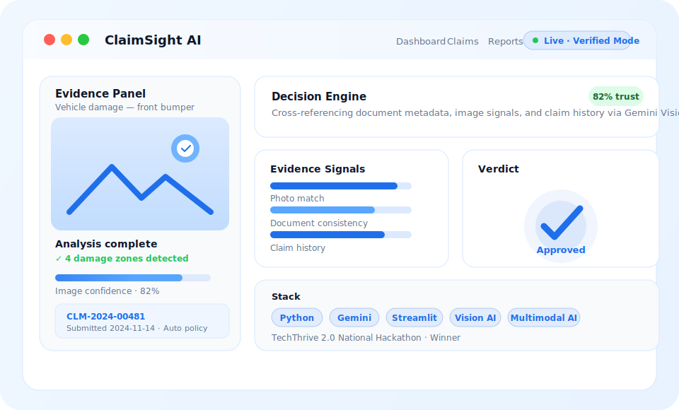
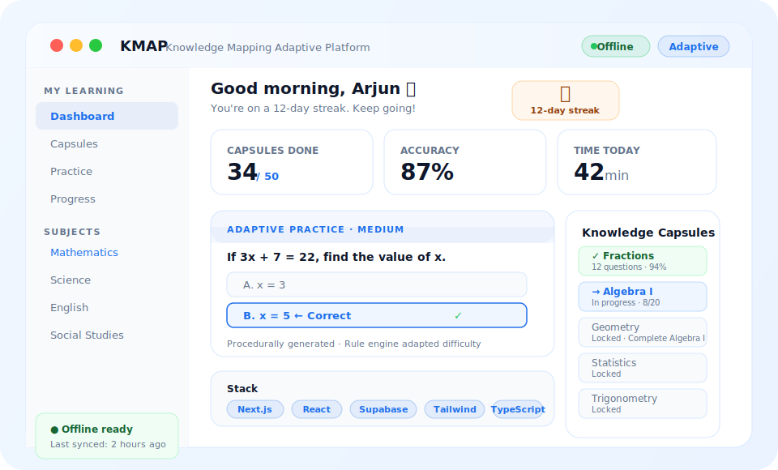
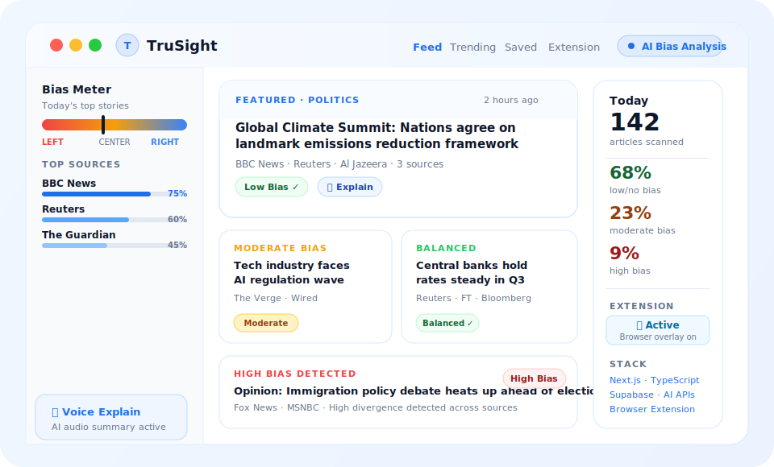

  

  

 

  &nbsp;
  &nbsp;
  &nbsp;
  &nbsp;
  

  &nbsp;&nbsp;
  &nbsp;&nbsp;
  

 

## Why I Build

  <em>Where product judgment, automation, and AI converge — that's where I work.</em>

I build because useful software can make complex work feel lighter — verifying an insurance claim, helping a learner study offline in a rural village, or giving people clearer context around the news they read. I'm a Computer Science Engineering student who cares deeply about the gap between what AI can do and what people actually experience. My focus isn't just on making things work; it's on making them understandable, reliable, and polished enough for real people to trust. Automation should reduce friction, not create it. Meaningful software starts with a real problem — and earns its place through every iteration that brings it closer to something people genuinely need.

 

  

 

  &nbsp;&nbsp;
  &nbsp;&nbsp;
  &nbsp;&nbsp;
  &nbsp;&nbsp;
  

 

## Featured Projects

  Selected work — shipped, live, and built with product intent.

 

<!-- ━━━━━━━━━━━━━━━━━━━━━━  ClaimSight AI  ━━━━━━━━━━━━━━━━━━━━━━ -->

<h3 align="center">ClaimSight AI</h3>

  AI-powered insurance claim verification platform using multimodal evidence analysis. 
  Combines Vision AI, document parsing, and a decision engine to produce trust scores 
  and structured verdicts — reducing manual review time and improving claim accuracy.

  <code>Vision AI</code>&nbsp;
  <code>Evidence Verification</code>&nbsp;
  <code>Decision Engine</code>&nbsp;
  <code>Image Analysis</code>&nbsp;
  <code>Multimodal Reasoning</code>

  <strong>Stack</strong>&nbsp;&nbsp;Python &nbsp;·&nbsp; Gemini &nbsp;·&nbsp; Streamlit

  
  &nbsp;
  

 

 

<!-- ━━━━━━━━━━━━━━━━━━━━━━  KMAP  ━━━━━━━━━━━━━━━━━━━━━━ -->

<h3 align="center">KMAP &nbsp;·&nbsp; Knowledge Mapping Adaptive Platform</h3>

  Privacy-first adaptive learning platform designed for rural and low-bandwidth environments. 
  Students progress through procedurally generated exercises with a rule engine that adapts 
  difficulty in real-time — no constant internet connection required.

  <code>Offline Learning</code>&nbsp;
  <code>Procedural Questions</code>&nbsp;
  <code>Adaptive Learning</code>&nbsp;
  <code>Knowledge Capsules</code>&nbsp;
  <code>Rule Engine</code>&nbsp;
  <code>Low Bandwidth</code>

  <strong>Stack</strong>&nbsp;&nbsp;React &nbsp;·&nbsp; Next.js &nbsp;·&nbsp; TypeScript &nbsp;·&nbsp; Supabase &nbsp;·&nbsp; Tailwind CSS

  
  &nbsp;
  

 

 

<!-- ━━━━━━━━━━━━━━━━━━━━━━  TruSight  ━━━━━━━━━━━━━━━━━━━━━━ -->

<h3 align="center">TruSight</h3>

  AI-powered news aggregation and political bias detection platform for reading current events 
  with more context. Features voice explanations, a companion browser extension, and 
  authentication — built so users can form more informed opinions.

  <code>News Aggregation</code>&nbsp;
  <code>Bias Detection</code>&nbsp;
  <code>Voice Explanation</code>&nbsp;
  <code>Browser Extension</code>&nbsp;
  <code>Authentication</code>

  <strong>Stack</strong>&nbsp;&nbsp;Next.js &nbsp;·&nbsp; TypeScript &nbsp;·&nbsp; Supabase &nbsp;·&nbsp; AI APIs

  
  &nbsp;
  

 

## Tech Stack

<table width="100%">
  <tr>
    <td width="33%" valign="top" align="center">
      <h4>Languages</h4>
      <picture>
        <source media="(prefers-color-scheme: dark)" srcset="https://skillicons.dev/icons?i=java,python,c,cpp,js,ts&theme=dark" />
        
      </picture>
    </td>
    <td width="33%" valign="top" align="center">
      <h4>Frontend</h4>
      <picture>
        <source media="(prefers-color-scheme: dark)" srcset="https://skillicons.dev/icons?i=react,nextjs,tailwind,html,css&theme=dark" />
        
      </picture>
    </td>
    <td width="33%" valign="top" align="center">
      <h4>Backend</h4>
      <picture>
        <source media="(prefers-color-scheme: dark)" srcset="https://skillicons.dev/icons?i=nodejs,express&theme=dark" />
        
      </picture>
    </td>
  </tr>
  <tr>
    <td width="33%" valign="top" align="center">
      <h4>Databases</h4>
      <picture>
        <source media="(prefers-color-scheme: dark)" srcset="https://skillicons.dev/icons?i=postgres,mongodb,supabase,firebase&theme=dark" />
        
      </picture>
    </td>
    <td width="33%" valign="top" align="center">
      <h4>Cloud &amp; DevOps</h4>
      <picture>
        <source media="(prefers-color-scheme: dark)" srcset="https://skillicons.dev/icons?i=docker,cloudflare,vercel&theme=dark" />
        
      </picture>
    </td>
    <td width="33%" valign="top" align="center">
      <h4>Developer Tools</h4>
      <picture>
        <source media="(prefers-color-scheme: dark)" srcset="https://skillicons.dev/icons?i=git,github,vscode,linux,figma&theme=dark" />
        
      </picture>
       <code>Jupyter Notebook</code>
    </td>
  </tr>
</table>

  <strong>AI &amp; ML</strong>&nbsp;&nbsp;
  <picture>
    <source media="(prefers-color-scheme: dark)" srcset="https://skillicons.dev/icons?i=huggingface&theme=dark" />
    
  </picture>
  &nbsp;&nbsp;<code>Gemini</code>&nbsp;<code>Groq</code>&nbsp;<code>OpenRouter</code>&nbsp;<code>LangChain</code>

 

## Currently Exploring

  

  &nbsp;&nbsp;
  &nbsp;&nbsp;
  &nbsp;&nbsp;
  

 

## GitHub Analytics

  
  

  

  

 

## GitHub Metrics

  

 

## Activity &amp; Progress

<table width="100%">
  <tr>
    <td width="50%" valign="top" align="center">
      <h4>WakaTime</h4>
      <!--START_SECTION:waka-->
      
      <!--END_SECTION:waka-->
    </td>
    <td width="50%" valign="top" align="center">
      <h4>LeetCode</h4>
      
    </td>
  </tr>
</table>

 

<h4 align="center">Contribution Snake</h4>

  <picture>
    <source media="(prefers-color-scheme: dark)" srcset="https://raw.githubusercontent.com/Pranavsanthoshnair/Pranavsanthoshnair/output/github-contribution-grid-snake-dark.svg" />
    <source media="(prefers-color-scheme: light)" srcset="https://raw.githubusercontent.com/Pranavsanthoshnair/Pranavsanthoshnair/output/github-contribution-grid-snake.svg" />
    
  </picture>

 

## Roadmap

Where I am investing deliberate practice right now.

 

<table width="100%">
  <tr>
    <td width="180"><strong>Machine Learning</strong></td>
    <td>
      
      &nbsp;<code>72%</code>
    </td>
  </tr>
  <tr>
    <td><strong>AI Engineering</strong></td>
    <td>
      
      &nbsp;<code>78%</code>
    </td>
  </tr>
  <tr>
    <td><strong>Cloud &amp; Infrastructure</strong></td>
    <td>
      
      &nbsp;<code>58%</code>
    </td>
  </tr>
  <tr>
    <td><strong>System Design</strong></td>
    <td>
      
      &nbsp;<code>54%</code>
    </td>
  </tr>
  <tr>
    <td><strong>Open Source</strong></td>
    <td>
      
      &nbsp;<code>66%</code>
    </td>
  </tr>
</table>

 

## Engineering Philosophy

The most valuable software starts as a specific inconvenience — not an abstract market opportunity. I try to build for those moments: the adjuster who has to manually cross-check fifty documents, the student in a village with no stable internet, the reader who can't tell if an article is slanted. Real problems make better products.

My approach is to ship the narrow, working version first, watch where it breaks for actual users, and iterate on the details until the experience feels inevitable rather than engineered. I care about interfaces because design is part of the contract — it tells people what a system is doing and whether they can trust it. With AI in the stack, that contract becomes even more important: intelligent automation should reduce friction, not add mystery. I'm still learning every day. I try to make that visible through shipped work.

 

  
<strong>Recent Activity</strong>

   

<!--START_SECTION:activity-->
- Shipping AI-powered products across insurance, education, and media.
- Contributing to open source through GSSoC, SSoC, and community repositories.
- Building full-stack systems with React, Next.js, Python, and Supabase.
<!--END_SECTION:activity-->

 

  
<strong>Latest Writing &amp; Projects</strong>

   

<!-- BLOG-POST-LIST:START -->
- **Portfolio** — [Case studies and build notes](https://pranavsnair.vercel.app)
- **KMAP** — National hackathon-winning adaptive learning platform for low-bandwidth environments.
- **TruSight** — News aggregation with political bias detection and voice explanations.
- **ClaimSight AI** — Multimodal insurance claim verification powered by Gemini Vision.
<!-- BLOG-POST-LIST:END -->

 

  
<strong>Automation Suite</strong>

   

This profile is kept current through a suite of GitHub Actions workflows:

| Workflow | Schedule | Purpose |
|---|---|---|
| `snake.yml` | Every 12 hours | Regenerates the contribution snake animation |
| `metrics.yml` | Daily at midnight | Refreshes the GitHub Metrics dashboard image |
| `wakatime.yml` | Daily at 00:30 | Updates the WakaTime coding-time section |
| `activity.yml` | Daily at 04:00 | Pulls the five most recent public GitHub events |
| `blog.yml` | Mondays at 08:00 | Syncs latest commits from active project repos |
| `update-readme.yml` | Daily at 06:00 | Verifies all automation markers are present |

 

## Contact

Open to internships, collaborations, and conversations about meaningful software.

 

<table align="center">
  <tr>
    <td align="center">
      
    </td>
    <td align="center">
      
    </td>
    <td align="center">
      
    </td>
  </tr>
  <tr>
    <td align="center">
      
    </td>
    <td align="center" colspan="2">
      
    </td>
  </tr>
</table>

 

  

  

