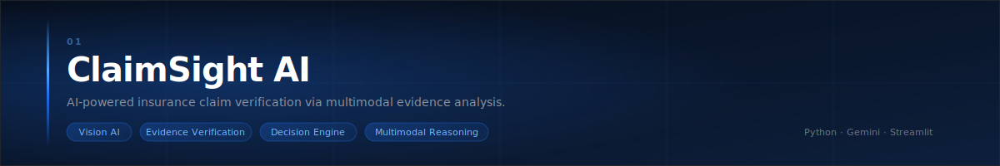
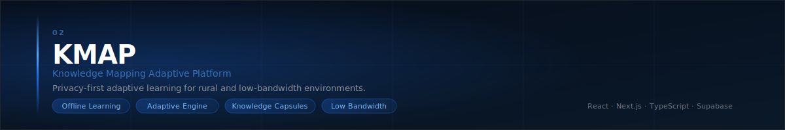
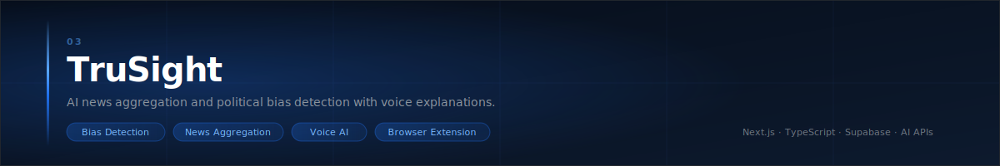

<!-- PRANAV S NAIR — GitHub Profile -->

&nbsp;
&nbsp;
&nbsp;
&nbsp;

  

&nbsp;

  

  

<!-- WHY I BUILD -->

<h2 align="center">Why I Build</h2>

 

<table width="100%" cellspacing="0" cellpadding="0" border="0">
<tr>
<td width="4" bgcolor="#1F6FEB">&nbsp;</td>
<td width="40">&nbsp;</td>
<td>

I build because useful software can make complex work feel lighter — verifying an insurance claim, helping a learner study offline in a rural village, or giving people clearer context around the news they read. I'm a CS Engineering student who cares deeply about the gap between what AI can do and what people actually experience. My focus isn't just on making things work — it's on making them understandable, reliable, and polished enough for real people to trust. Automation should reduce friction, not create it.

  

&nbsp;
&nbsp;
&nbsp;

</td>
<td width="40">&nbsp;</td>
</tr>
</table>

  

&nbsp;
&nbsp;
&nbsp;
&nbsp;
&nbsp;

  

  

<!-- FEATURED PROJECTS -->

<h2 align="center">Featured Projects</h2>

Selected work — shipped, live, and built with product intent.

  

<!-- ClaimSight AI -->

  

<table width="100%" cellspacing="0" cellpadding="0" border="0">
<tr>
<td width="50%" valign="top">

**AI-powered insurance claim verification** using multimodal evidence analysis. Combines Vision AI, document parsing, and a decision engine to produce trust scores and structured verdicts — reducing manual review time and improving claim accuracy.

</td>
<td width="48">&nbsp;</td>
<td width="50%" valign="top">

&nbsp;
&nbsp;

  

</td>
</tr>
</table>

  

  

<!-- KMAP -->

  

<table width="100%" cellspacing="0" cellpadding="0" border="0">
<tr>
<td width="50%" valign="top">

**Privacy-first adaptive learning platform** for rural and low-bandwidth environments. Procedurally generated exercises with a rule engine that adapts difficulty in real-time — no constant internet connection required.

</td>
<td width="48">&nbsp;</td>
<td width="50%" valign="top">

  

</td>
</tr>
</table>

  

  

<!-- TruSight -->

  

<table width="100%" cellspacing="0" cellpadding="0" border="0">
<tr>
<td width="50%" valign="top">

**AI-powered news aggregation and bias detection.** Features political bias scoring, voice explanations, a companion browser extension, and authentication — built so users can form more informed opinions.

</td>
<td width="48">&nbsp;</td>
<td width="50%" valign="top">

  

</td>
</tr>
</table>

  

  

<!-- TECH STACK -->

<h2 align="center">Tech Stack</h2>

 

<table width="100%" cellspacing="0" cellpadding="20" border="0">
<tr>
<td width="50%" align="center" valign="top">

<b>Languages</b>

  

<b>Frontend</b>

</td>
<td width="50%" align="center" valign="top">

<b>Backend &amp; Databases</b>

  

<b>Cloud, DevOps &amp; Tools</b>

</td>
</tr>
</table>

 

<b>AI &amp; ML</b>

  
&nbsp;
&nbsp;
&nbsp;
&nbsp;

  

  

<!-- CURRENTLY EXPLORING -->

<h2 align="center">Currently Exploring</h2>

 

  
&nbsp;
&nbsp;
&nbsp;

  

  

<!-- GITHUB ANALYTICS -->

<h2 align="center">GitHub Analytics</h2>

 

&nbsp;

  

  

  

  

<!-- GITHUB METRICS -->

<h2 align="center">GitHub Metrics</h2>

 

  

  

<!-- WAKATIME & LEETCODE -->

<h2 align="center">WakaTime &amp; LeetCode</h2>

 

<table width="100%" cellspacing="0" cellpadding="0" border="0">
<tr>
<td width="50%" align="center" valign="top">

<b>Coding Time</b>

 
<!--START_SECTION:waka-->

<!--END_SECTION:waka-->
</td>
<td width="50%" align="center" valign="top">

<b>Problem Solving</b>

 

</td>
</tr>
</table>

  

  

<!-- CONTRIBUTION SNAKE -->

<h2 align="center">Contribution Snake</h2>

 

<picture>
  <source media="(prefers-color-scheme: dark)" srcset="./output/github-contribution-grid-snake-dark.svg" />
  <source media="(prefers-color-scheme: light)" srcset="./output/github-contribution-grid-snake.svg" />
  
</picture>

  

  

<!-- ENGINEERING PHILOSOPHY -->

<h2 align="center">Engineering Philosophy</h2>

 

<table width="100%" cellspacing="0" cellpadding="0" border="0">
<tr>
<td width="4" bgcolor="#1F6FEB">&nbsp;</td>
<td width="40">&nbsp;</td>
<td>

<b>Specificity over abstraction.</b>&nbsp; The most valuable software starts as a specific inconvenience — not an abstract market opportunity. Build for those moments: the adjuster who has to manually cross-check fifty documents, the student in a village without internet, the reader who can't tell if an article is slanted. Real problems make better products.

 

<b>Ship narrow, iterate wide.</b>&nbsp; Ship the narrow, working version first. Watch where it breaks for actual users. Iterate until the experience feels inevitable rather than engineered. Design is part of the contract — it tells people what a system is doing and whether they can trust it. With AI in the stack, intelligent automation should reduce friction, not add mystery.

 

&nbsp;
&nbsp;
&nbsp;
&nbsp;

</td>
<td width="40">&nbsp;</td>
</tr>
</table>

  

  

<!-- CONTACT -->

<h2 align="center">Contact</h2>

 

Open to internships, collaborations, and conversations about meaningful software.

 

&nbsp;

  

&nbsp;
&nbsp;

  

<!-- FOOTER -->

