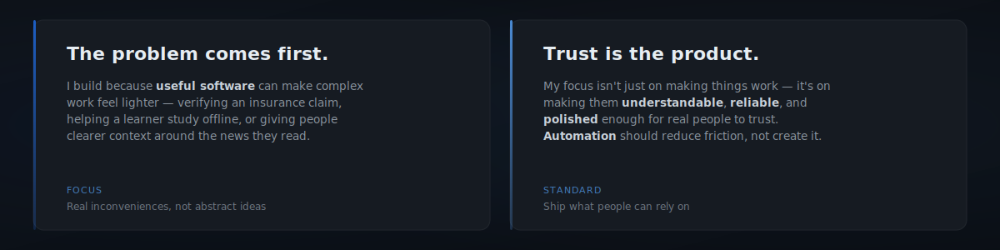

<!-- PRANAV S NAIR — GitHub Profile -->

&nbsp;
&nbsp;
&nbsp;

 
&nbsp;

&nbsp;
&nbsp;
&nbsp;

 
&nbsp;
&nbsp;
&nbsp;
&nbsp;
&nbsp;
&nbsp;

Selected work shipped, live, and built with product intent.

<b>AI-powered insurance claim verification platform.</b> Combines Vision AI, document parsing, and a decision engine to produce trust scores and structured verdicts — reducing manual review from hours to minutes.
  
&nbsp;
&nbsp;
&nbsp;

 

 AI Platform &nbsp;·&nbsp; National Hackathon Winner &nbsp;·&nbsp; 2026

<b>Privacy-first adaptive learning platform for rural and low-bandwidth environments.</b> Procedurally generated exercises with a rule engine that adapts difficulty in real-time — no constant internet required.
  

 
&nbsp;

 EdTech Platform &nbsp;·&nbsp; Offline-First &nbsp;·&nbsp; 2026

<b>AI-powered news aggregation and political bias detection.</b> Features voice explanations, a companion browser extension, and authentication — built so users can form more informed opinions.
  
&nbsp;
&nbsp;

 
&nbsp;

 News Platform &nbsp;·&nbsp; Bias Detection &nbsp;·&nbsp; 2025

LANGUAGES 

  
FRONTEND 

  
BACKEND & DATABASES 

  
AI & ML 
&nbsp;

 
&nbsp;
&nbsp;
&nbsp;
&nbsp;

  
CLOUD, DEVOPS & TOOLS 

 
&nbsp;
&nbsp;
&nbsp;

&nbsp;

  

  

<table cellspacing="0" cellpadding="0" border="0" width="100%">
<tr>
<td width="50%" align="center" valign="top">

<b>Coding Time</b>

<!--START_SECTION:waka-->
Waiting for WakaTime data...
<!--END_SECTION:waka-->
</td>
<td width="50%" align="center" valign="top">

<b>Problem Solving</b>

</td>
</tr>
</table>

CONTRIBUTION SNAKE

<picture>
  <source media="(prefers-color-scheme: dark)" srcset="https://raw.githubusercontent.com/Pranavsanthoshnair/Pranavsanthoshnair/output/github-contribution-grid-snake-dark.svg" />
  <source media="(prefers-color-scheme: light)" srcset="https://raw.githubusercontent.com/Pranavsanthoshnair/Pranavsanthoshnair/output/github-contribution-grid-snake.svg" />
  
</picture>

**Real problems over abstractions** — Build for the adjuster, the offline student, the biased-news reader.

**Ship narrow, iterate wide** — Launch the smallest working version. Let real usage reveal what's next.

**Design builds trust** — Interfaces tell people what a system is doing and whether they can rely on it.

**AI reduces friction** — Intelligent automation should make things clearer, not more mysterious.

 

&nbsp;
&nbsp;
&nbsp;
&nbsp;

Open to collaborations, internships, and conversations about building meaningful software.

&nbsp;
&nbsp;
&nbsp;
&nbsp;

 

